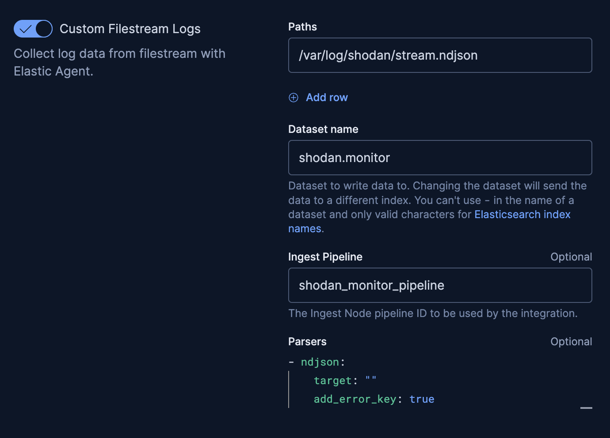

# Shodan to Elastic

Stream Shodan Monitor data into Elasticsearch using a lightweight forwarder + Elastic Agent.

## Features

## Shodan to Elastic Forwarder

This project streams Shodan alert data to a local file for ingestion into Elastic via Elastic Agent.

### How to Run

1. **Clone the repository** and enter the directory:
	```bash
	git clone https://github.com/morgan-atwood/shodan-to-elastic.git
	cd shodan-to-elastic
	```

2. **Create a `.env` file** with your Shodan API key:
	```env
	SHODAN_API_KEY=your_api_key_here
	```

3. **Run the installer:**
	```bash
	./install.sh
	```
	This will install dependencies, copy the forwarder script, and set up the service.

4. **Check logs and output:**
	- Service logs: `journalctl -u shodan-forwarder -f`
	- Output file: `/var/log/shodan/stream.ndjson`

### Elastic Agent Policy Setup

To ingest the Shodan data, configure Elastic Agent to collect logs from `/var/log/shodan/stream.ndjson` as a custom filestream log. Example settings:



- **Paths:** `/var/log/shodan/stream.ndjson`
- **Dataset name:** `shodan.monitor`
- **Ingest Pipeline:** `shodan_monitor_pipeline` (Included in "ingest_pipleline".txt)
- **Parsers:**
  ```yaml
  - ndjson:
		target: ""
		add_error_key: true
  ```

### Legal Disclaimer

> **Warning:** This project is provided as a reference implementation and is **not intended for production use** without review. Please audit the code, configuration, and security before deploying in any environment. The authors are not responsible for any misuse or damages resulting from use of this software.


